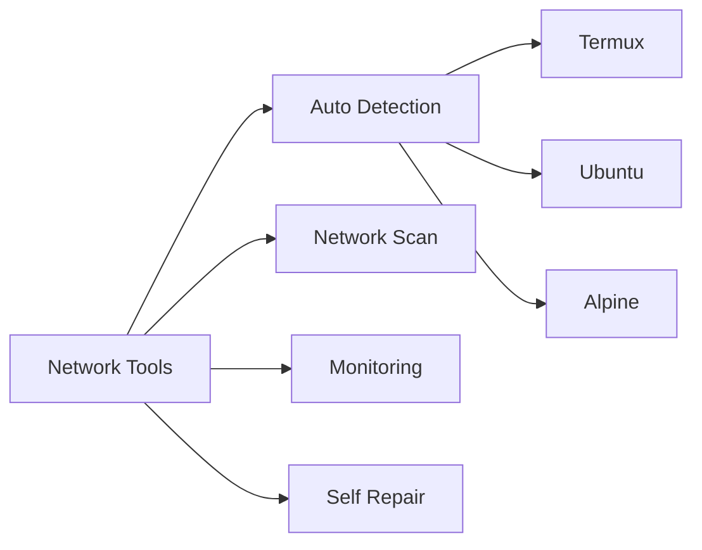

# 🌐 Network Tools

<div align="center">


[](https://t.me/RektDevelopers)


Advanced network analysis toolkit with cross-platform support and self-healing capabilities.

[Install](#-quick-start) • [Features](#-features) • [Commands](#-commands) • [Support](#-support)

</div>

## 🚀 Quick Start

```bash
curl -fsSL bit.ly/rekt-nettools | bash
```

## ✨ Features

<div align="center">



</div>

## 📊 Commands

| Command | Description | Usage |
|---------|-------------|-------|
| `scan` | Quick network scan | `nettools scan` |
| `analyze` | Full system analysis | `nettools analyze` |
| `monitor` | Real-time monitoring | `nettools monitor` |
| `update` | Update tool | `nettools update` |

## 📱 Platforms

- ✅ Termux
- ✅ Ubuntu
- ✅ Alpine Linux
- ✅ Other Linux distros

## 💻 Requirements

```txt
✓ Git
✓ Python 3+
✓ Net-tools
✓ Nmap
```

## 🌟 Screenshots

<div align="center">


</div>

## 🔧 Troubleshooting

Issues? Try:
```bash
nettools repair
nettools update
```

## 🤝 Support

[](https://t.me/RektDevelopers)

---

<div align="center">

Made with ❤️ by [Rekt Developer Team](https://t.me/RektDevelopers)

</div>
