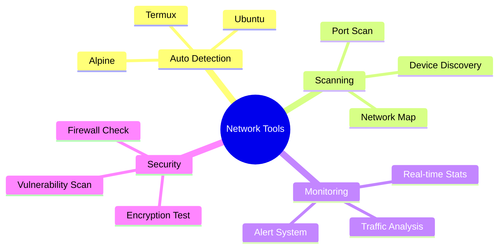

<div align="center">

# 🌐 Network Tools • নেটওয়ার্ক টুলস


[](https://t.me/RektDevelopers)
[](https://github.com/Rekt-Developer/network-tools)


**Advanced Network Analysis Toolkit • উন্নত নেটওয়ার্ক বিশ্লেষণ টুলকিট**

[Install • ইনস্টল](#-quick-start--দ্রুত-শুরু) • [Features • বৈশিষ্ট্য](#-features--বৈশিষ্ট্য) • [Support • সহায়তা](#-support--সহায়তা)

</div>

## 🚀 Quick Start • দ্রুত শুরু

```bash
# One-Line Installation • এক-লাইন ইনস্টলেশন
curl -fsSL install.rekt.tools | bash
```

## ✨ Features • বৈশিষ্ট্য



## 📊 Commands • কমান্ড

| Command | বাংলা | Description | ব্যবহার |
|---------|-------|-------------|----------|
| `scan` | স্ক্যান | Quick network scan | `nettools scan` |
| `analyze` | বিশ্লেষণ | Full system analysis | `nettools analyze` |
| `monitor` | পর্যবেক্ষণ | Real-time monitoring | `nettools monitor` |
| `secure` | সুরক্ষা | Security check | `nettools secure` |

## 💻 System Support • সিস্টেম সাপোর্ট

- ✅ Termux (টারমাক্স)
- ✅ Ubuntu (উবুন্টু)
- ✅ Kali Linux (কালি লিনাক্স)
- ✅ Alpine (আলপাইন)

## 🛠️ Quick Commands • দ্রুত কমান্ড

```bash
# Install • ইনস্টল
pkg install nettools

# Scan Network • নেটওয়ার্ক স্ক্যান
nettools scan

# Monitor • মনিটরিং
nettools monitor

# Update • আপডেট
nettools update
```

## 🌟 Features • বৈশিষ্ট্য

- 🔄 Auto-Detection • স্বয়ংক্রিয় সনাক্তকরণ
- 🔍 Deep Scanning • গভীর স্ক্যানিং
- 📊 Live Monitoring • লাইভ মনিটরিং
- 🛡️ Security Tools • সুরক্ষা টুলস
- 🔧 Self-Repair • স্ব-মেরামত

## 📱 Support • সহায়তা

[](https://t.me/RektDevelopers)

---

<div align="center">

Made with ❤️ by [Rekt Developer Team](https://t.me/RektDevelopers)  
রেক্ট ডেভেলপার টিম দ্বারা নির্মিত

</div>
